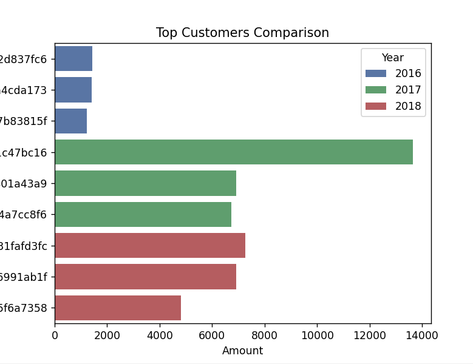
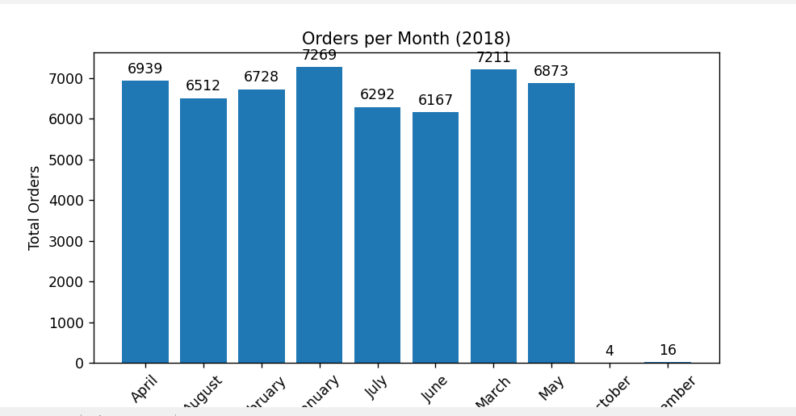
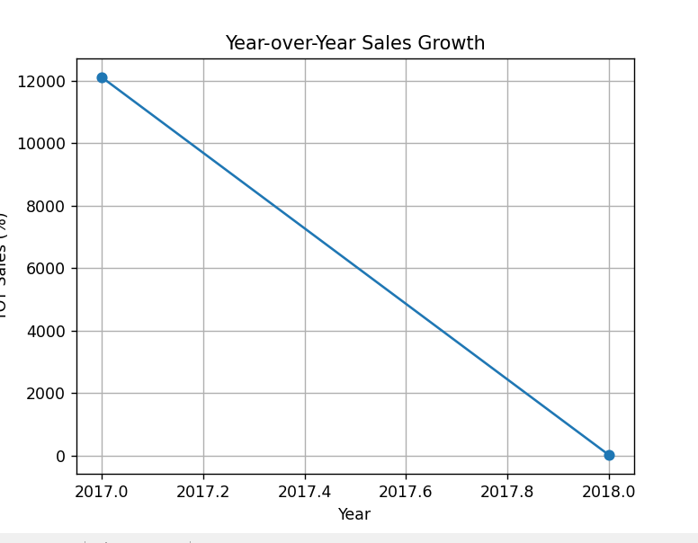
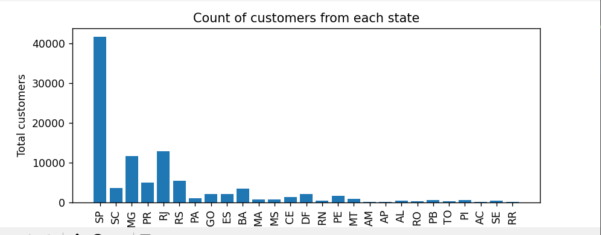

# 📊 Ecommerce Sales Analysis

## 🧠 About the Project
I worked on this project to explore how ecommerce data can be used to understand customer behavior and business performance. The goal was to go beyond just writing queries and actually extract meaningful insights that could help in decision-making.

---

## 🛠️ Tools I Used
- SQL (MySQL) for data extraction and analysis  
- Python (Pandas, Matplotlib, Seaborn) for data processing and visualization  

---

## 🔍 What I Explored
While working on this dataset, I focused on:

- Understanding **who the top customers are** and how much they contribute to revenue  
- Analyzing **sales trends over time (monthly & yearly)**  
- Calculating **year-over-year (YoY) growth**  
- Measuring **customer retention (within 6 months of first purchase)**  
- Exploring **cumulative and moving average sales patterns**  

---

## 📈 Key Insights
Some interesting findings from the analysis:

- A small group of customers contributes a **significant portion of total revenue**  
- Sales showed noticeable growth in certain years, with **clear spikes in demand**  
- Customer retention within 6 months is relatively **low**, indicating scope for improvement  
- Sales patterns become clearer when viewed using **cumulative trends and moving averages**  

---

## 📊 Visualizations
I created multiple visualizations to better understand the data, including:

- Bar charts for top customers  
- Line charts for sales trends and YoY growth  
- Comparative charts for yearly performance  

*(You can find sample outputs in the images section)*

---

## 🚀 What I Learned
This project helped me:
- Strengthen my SQL skills (especially window functions and aggregations)  
- Understand how to turn raw data into meaningful insights  
- Improve my data visualization and storytelling skills  

---

## 🔗 Future Improvements
- Build an interactive dashboard using Streamlit  
- Perform advanced analysis like customer segmentation or forecasting  
- Optimize queries for larger datasets  

---

## 💡 Final Thoughts
This project gave me a practical understanding of how data analysis works in real-world scenarios. It’s not just about queries — it’s about finding insights that actually matter.
